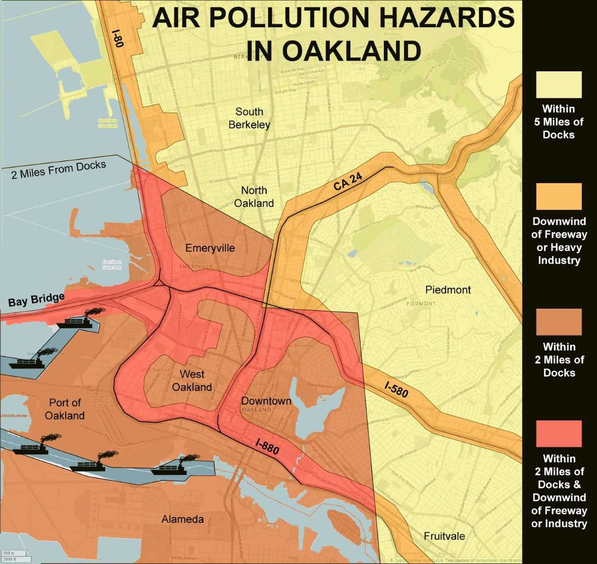

# 2021 Air Quality in Oakland’s Wealthiest and Poorest Neighborhoods

## Project Motivation
#### Goal
The primary objective of this project is to evaluate various neighborhoods in Oakland by utilizing data sourced from Purple Air Monitors to conduct an in-depth analysis of air quality trends.
#### Background
The selection of Oakland for this study, particularly focusing on the year 2021, was deliberate due to its reputation for poor air quality in disadvantaged neighborhoods. Multiple factors contribute to this issue, including redlining, proximity to major highways, and the port, which often affects economically disadvantaged areas. 

## Statistics
#### First Time Series
The initial examination involved studying four air monitors in affluent neighborhoods alongside four monitors in less privileged neighborhoods. Notably, both sets exhibited similar trends, with peaks observed in early fall and winter. Additionally, a classical decomposition was conducted to distinguish seasonality from the overall trend. However, as this analysis was limited to the year 2021, its findings were somewhat inconclusive.

#### Hypthoesis Test
A t-test comparing air quality data from one affluent neighborhood monitor and another from a poorer neighborhood yielded a p-value of 0.002 within a 95% confidence interval. This result signifies that we can reject the null hypothesis as the significance level is below 5%.

## Discussion
The year 2021 provided an intriguing backdrop for observation as the world was recovering from the Covid-19 pandemic which also impacted air quality around the world along with Oakland. Historically, a disparity in air quality between affluent and impoverished neighborhoods has existed. However, for a more robust analysis of trends and discrepancies among neighborhoods, a larger dataset encompassing numerous locations is necessary. Furthermore, it's crucial to acknowledge potential discrepancies due to individual installation of air monitors, potential human errors, missing data, and affordability issues associated with these devices.
